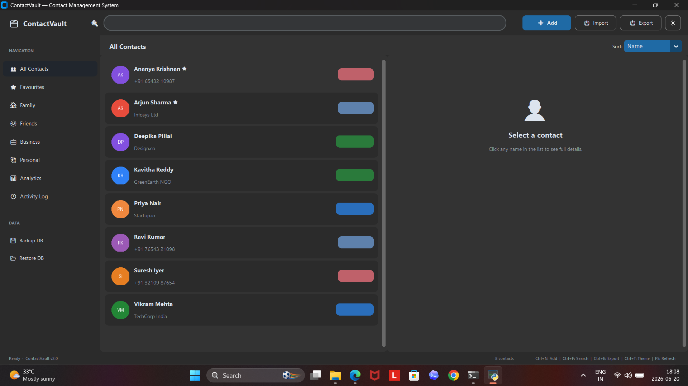
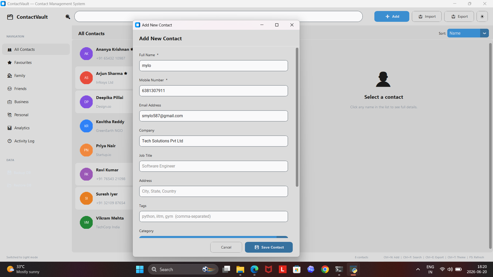
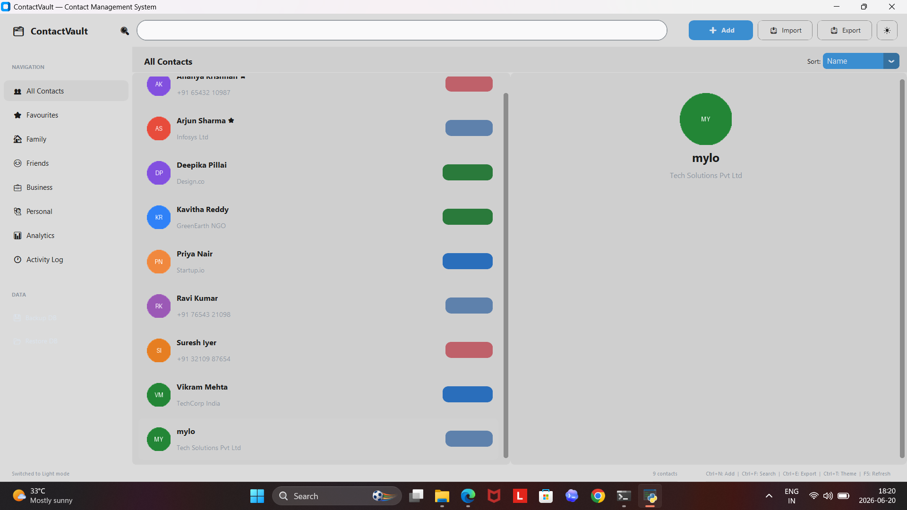
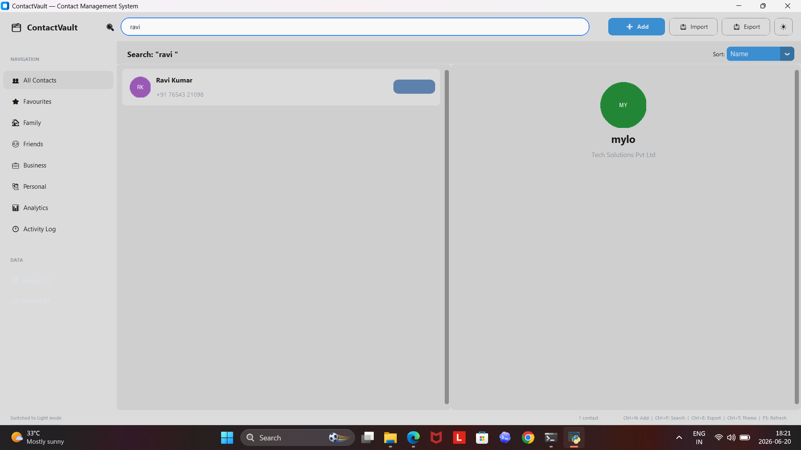
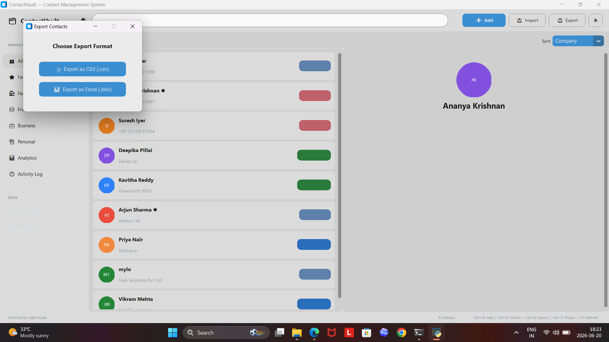
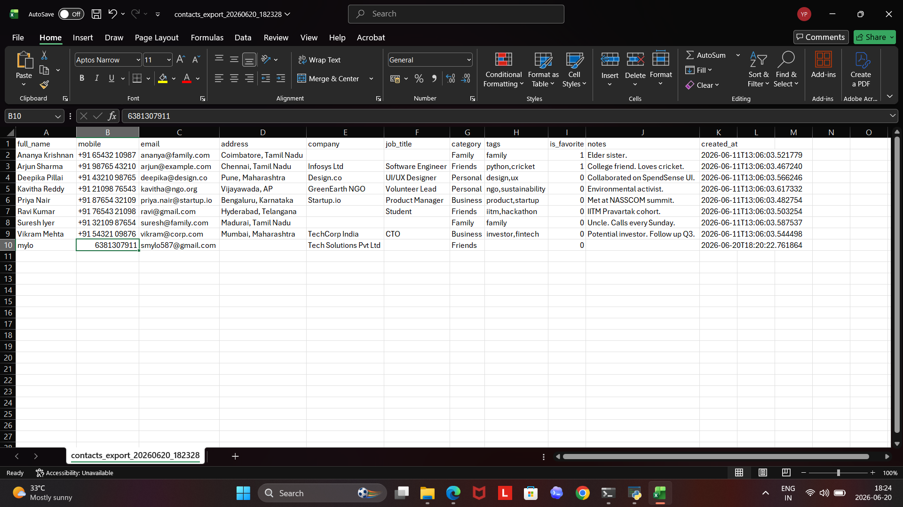
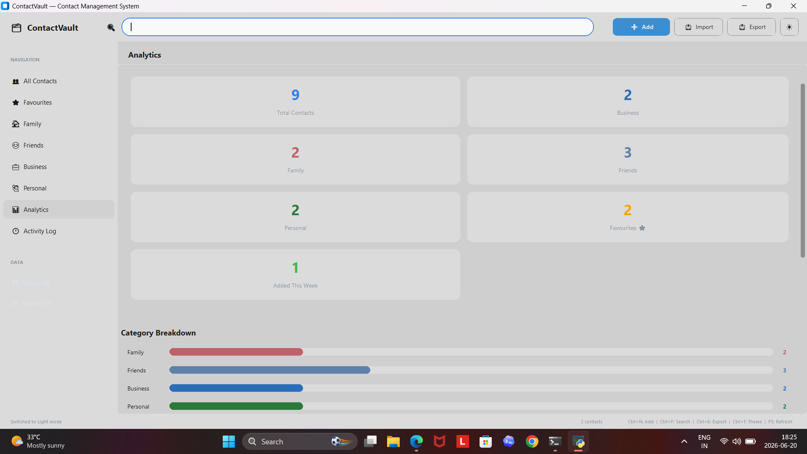

<div align="center">

# 🗂 ContactVault

**A professional-grade Contact Management System built with Python &  CustomTkinter**

[](https://python.org)
[](https://github.com/TomSchimansky/CustomTkinter)
[](https://sqlite.org)
[](LICENSE)


[Features](#features) · [Installation](#installation) · [Usage](#usage) · [Architecture](#architecture) · [Database Design](#database-design)

</div>

---

## 📌 Project Overview

ContactVault is a **lightweight CRM-style desktop application** that goes far beyond a basic CRUD system. It provides a polished, modern interface for managing personal and professional contacts — complete with smart search, category filtering, analytics dashboards, import/export pipelines, and full dark/light theming.

Built with a clean **MVC architecture** across 5 modular Python files, it demonstrates real-world software engineering patterns including the observer pattern, data validation layers, SQLite WAL journaling, and opinionated UI design using CustomTkinter.

---

## ✨ Features

### Core
| Feature | Detail |
|---|---|
| **Add / Edit / Delete** | Full CRUD with inline validation |
| **Search** | Real-time search across name, phone, email, company, tags |
| **Categories** | Family · Friends · Business · Personal with colour-coded pills |
| **Favourites** | Star system with dedicated filtered view |
| **Sort & Filter** | Sort by Name, Company, Date Added, Category |
| **Persistent Storage** | SQLite with WAL mode for reliability |
| **Duplicate Detection** | Warns before saving identical name or mobile |

### Import / Export
| Format | Import | Export |
|---|---|---|
| CSV | ✅ | ✅ |
| Excel (.xlsx) | ❌ | ✅ |
| Database Backup | ✅ | ✅ |

### UX & Design
- 🌙 Dark mode + ☀️ Light mode toggle
- Colour-coded avatar initials (no profile picture required)
- Profile picture support for custom avatars
- Responsive two-panel layout (list + detail)
- Quick-action buttons: 📞 Call, ✉ Email, ⭐ Favourite
- Contact tags with visual pill indicators
- Rich notes section per contact

### Analytics
- Stats dashboard: total, per-category, favourites, added this week
- Category breakdown bar chart
- Live recent activity feed

### Professional
- Full activity log (add, edit, delete, import, export, view, favourite)
- Keyboard shortcuts (Ctrl+N, Ctrl+F, Ctrl+E, Ctrl+T, Delete, F5)
- Status bar with shortcut reference
- Observer pattern for reactive UI updates

---

## 🗄 Database Design

```sql
contacts (
    id          INTEGER PRIMARY KEY AUTOINCREMENT,
    full_name   TEXT    NOT NULL,
    mobile      TEXT    NOT NULL,
    email       TEXT,
    address     TEXT,
    company     TEXT,
    job_title   TEXT,
    notes       TEXT,
    category    TEXT    DEFAULT 'Personal',  -- Family|Friends|Business|Personal
    tags        TEXT,                         -- comma-separated
    is_favorite INTEGER DEFAULT 0,
    avatar_path TEXT,
    created_at  TEXT    NOT NULL,
    updated_at  TEXT    NOT NULL
)

activity_log (
    id           INTEGER PRIMARY KEY AUTOINCREMENT,
    action       TEXT NOT NULL,               -- added|edited|deleted|...
    contact_name TEXT NOT NULL,
    detail       TEXT,
    timestamp    TEXT NOT NULL
)
```

Indexes on `full_name`, `category`, and `is_favorite` ensure fast filtered queries at scale.

---

## 🏗 Architecture

```
PRODIGY_SD_03/
│
├── main.py              # Entry point & bootstrap
├── models.py            # Data models: Contact, Category, AppStats, ActivityLog
├── database.py          # SQLite persistence layer (DAO pattern)
├── contact_manager.py   # Business logic / Controller
├── ui.py                # Full CustomTkinter UI (View)
│── Screenshots
├── exports/             # CSV / Excel exports land here
├── backups/             # Database backup snapshots
│
├── requirements.txt
├── README.md
└── LICENSE
```

### MVC Breakdown

```
Model       →   models.py        (Contact, Category, AppStats dataclasses)
Controller  →   contact_manager.py + database.py
View        →   ui.py            (App, ContactDetailPanel, ContactFormDialog, etc.)
```

The `ContactManager` uses an **observer pattern** — the UI subscribes to events (`contact_added`, `contact_updated`, etc.) so changes propagate reactively without tight coupling.

---

## 🚀 Installation

### Prerequisites
- Python 3.9 or higher
- pip

### Steps

```bash
# 1. Clone the repository
git clone https://github.com/yourusername/ContactVault.git
cd ContactVault

# 2. (Optional) Create a virtual environment
python -m venv venv
source venv/bin/activate      # Linux/macOS
venv\Scripts\activate         # Windows

# 3. Install dependencies
pip install -r requirements.txt

# 4. Run the application
python main.py
```

The database is created automatically at `database/contacts.db` on first launch. Eight demo contacts are pre-loaded to demonstrate the UI.

---

## 🎮 Usage Guide

### Adding a Contact
1. Click **➕ Add Contact** in the toolbar, or press `Ctrl+N`
2. Fill in the required fields (name, mobile)
3. Assign a category and optional tags
4. Click **Save Contact**

### Searching
- Type in the search bar at the top (searches name, phone, email, company, tags in real-time)
- Press `Ctrl+F` to focus the search bar from anywhere

### Import from CSV
- Click **📥 Import** → select a CSV file
- Expected columns: `full_name`, `mobile`, `email`, `address`, `company`, `job_title`, `category`, `tags`, `notes`
- Duplicate detection skips contacts with matching name or mobile

### Export
- Click **📤 Export** → choose CSV or Excel
- Files saved to the `exports/` folder with a timestamp

### Backup / Restore
- Use the sidebar buttons to create `.db` snapshots in `backups/`
- Restore from any backup file — confirmation required

### Keyboard Shortcuts
| Shortcut | Action |
|---|---|
| `Ctrl+N` | Add new contact |
| `Ctrl+F` | Focus search bar |
| `Ctrl+E` | Export to CSV |
| `Ctrl+T` | Toggle dark/light theme |
| `Delete` | Delete selected contact |
| `F5` | Refresh current view |

---

## 🔭 Future Enhancements

- [ ] Contact merge for resolving duplicates
- [ ] vCard (.vcf) import / export for phone sync
- [ ] Birthday reminders with desktop notifications
- [ ] Bulk edit / bulk delete
- [ ] Contact sharing via QR code
- [ ] Cloud sync (Firebase / Supabase)
- [ ] Mobile companion app (Kivy or Flutter)
- [ ] Full-text search with SQLite FTS5

---


## 📸 Screenshots

### Home Screen


### Add Contact


### Contact Added


### Search Contact


### Export Options


### Excel Export


### Analytics Dashboard

---

## 🤝 Contributing

Pull requests are welcome. For major changes, please open an issue first to discuss what you would like to change.


---

## 👤 Author

**Yoga Prabu E**

<p>GitHub: https://github.com/yoga-prabu26</p>
<p>LinkedIn: https://www.linkedin.com/in/yogaprabue07/</p>


Built as part of **Software Development Internship — Task 03**

---

## 📄 License

[MIT](LICENSE) © 2025 ContactVault

---

